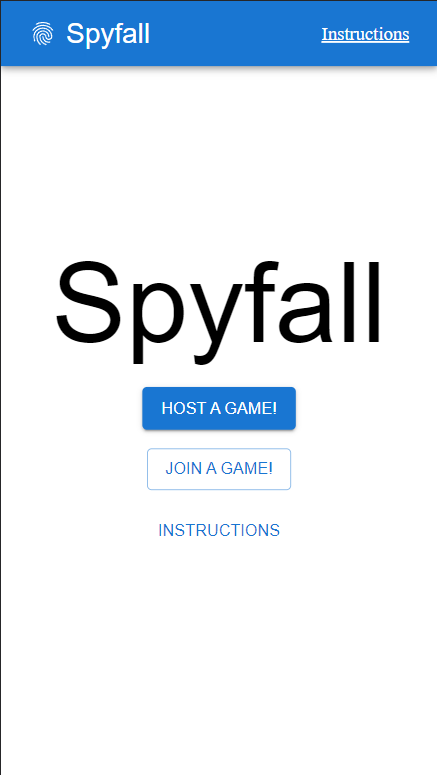
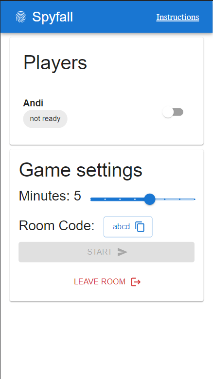
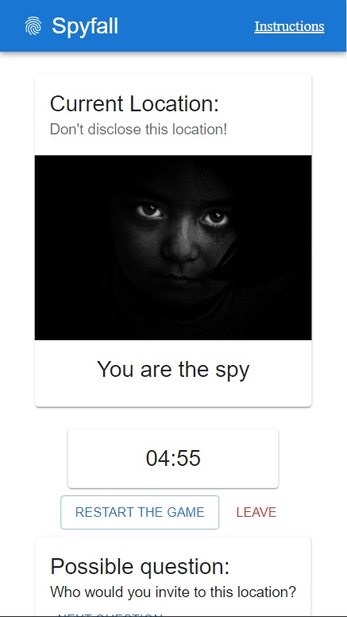

# Spyfall Webapp

Using [React](https://reactjs.org/), the web frontend for the Spyfall game can be controlled over websockets.
You can access the site at  when hosted using docker-compose and at
 when you host it natively through NodeJS.

When you host a game or join a running one using the room code, you will be navigated to a waiting room.

The game leader will be able to change the length of the game and to kick players from the room.
When all players flip their switch to ready up, the leader can also start the game.

Once a game is started, you will be navigated to the game room. In the game room, the agents will be able to
see the round's location.

The spy will only not be able to see this!

---

# IMPORTANT!

The game is based on websockets and data send through the server by the game leader.
Once the game leader leaves a game, a lot of unwanted behaviour can occur.
You might need to restart the game.